# peakpredict — when will an athlete peak?

**A production-style platform that scrapes elite-athletics career data, models the
performance-vs-age curve, and predicts *when* a sprinter will hit their peak — served
through a credential-gated analytics dashboard.**

It is built as three loosely-coupled components behind clean data contracts: a
**scraper**, an **ML pipeline**, and a **Streamlit dashboard**. The pipeline runs a
*ladder* of models — a baseline, a regularized linear model, and a PyTorch RNN — and
ships the one that wins on a leakage-safe temporal evaluation. On the full dataset that
winner is a **bidirectional RNN at 1.38-year mean absolute error**, a 38% improvement on
the baseline.

> Scope (v1): the sprints — 100 m, 200 m, 400 m, men and women. Everything is
> event-group-agnostic, so new event families are added by config, not rewrites.

---

## At a glance

| | |
|---|---|
| **Data** | 15,981 athletes · 1.9 M individual results · scraped, cleaned, normalized to 162 k season-bests |
| **Labels** | 10,191 per-(athlete, event) peak ages derived from full-career trajectory fits |
| **Models** | Group-mean baseline → Pooled Ridge → **Bidirectional RNN** (PyTorch), selected on a temporal split |
| **Best result** | **1.38 y MAE** held-out (5-fold, athlete-grouped) · 0.84 interval coverage · 38% skill over baseline |
| **Experimentation** | Comet.ml experiment tracking + Bayesian hyperparameter optimization |
| **Engineering** | Monorepo, pydantic data contracts, DuckDB + Parquet, **91 tests**, ruff-clean, versioned artifact bundles |
| **Product** | Multi-page Streamlit app: explore 14 k athletes, upload your own, get a projected peak |

<p align="center">
  
</p>

---

## The core idea, in one chart

A normalized performance **score** (higher = better, comparable across events) traces an
inverted-U over an athlete's career. The **peak** is the top of that curve. The system
shows the **observed** peak once an athlete has demonstrably peaked, and the model's
**projected** peak while they are still ascending.

| Already peaked → observed peak | Still ascending → projected peak |
|---|---|
|  |  |

Each chart overlays the athlete's season-bests, the fitted trajectory, the population
percentile band, and the peak (solid = observed, dashed = projected).

---

## What it demonstrates

This project is a portfolio piece spanning four disciplines; each links to a deep-dive.

- **[Software engineering →](docs/architecture.md)** — three components communicating only
  through versioned data contracts, shipped as one installable package so the shared
  contracts have a single implementation. Pydantic models at every boundary, dependency
  injection, 91 unit + integration tests, an end-to-end test that runs the whole
  raw→build→publish→predict path.
- **[Data engineering & data science →](docs/data-pipeline.md)** — Selenium scraping of a
  credentialed source with session recycling and resumability; DuckDB raw store; a
  direction-aware z-score normalization that makes times and distances comparable;
  leakage-safe early-career feature engineering; a third-party (Wikidata) enrichment join;
  and a data-quality guard found by *looking at the predictions*.
- **[ML modeling & experimentation →](docs/modeling.md)** — a defining of "peak" as a
  learnable label, a baseline-first model ladder, a PyTorch sequence model, **Comet.ml**
  tracking, a curated sweep and a **Bayesian optimizer**, and the rigorous finding that
  *data volume — not architecture — was the binding constraint*.
- **[Predictive analysis & validation →](docs/results.md)** — temporal, athlete-grouped
  cross-validation; calibrated prediction intervals; synthetic error decomposition; and an
  honest account of where the model is strong (typical peakers) and where it regresses to
  the mean (genuine late-bloomers).

The **[dashboard walkthrough →](docs/dashboard.md)** ties it together from the user's side.

---

## Architecture

Three components, one package, communicating only through data on disk:

```mermaid
flowchart LR
    SRC[("tilastopaja.info<br/>(credentialed source)")]
    subgraph A["scraper · Component A"]
      direction TB
      SC["Selenium + session recycling<br/>resumable, throttled"]
    end
    RAW[("data/raw<br/>DuckDB raw store")]
    subgraph B["pipeline · Component B"]
      direction TB
      NORM["normalize → season-bests"]
      LAB["trajectory fit → peak labels"]
      FEAT["leakage-safe features"]
      MODEL["model ladder<br/>baseline · ridge · RNN"]
    end
    ART[("data/artifacts/&lt;version&gt;<br/>versioned bundle")]
    subgraph C["dashboard · Component C"]
      direction TB
      APP["Streamlit app<br/>explore · upload · predict"]
    end

    SRC --> SC --> RAW --> NORM --> LAB --> FEAT --> MODEL --> ART --> APP

    style A fill:#16263A,color:#fff
    style B fill:#16263A,color:#fff
    style C fill:#FF4D17,color:#fff
```



Two invariants hold the system together:

1. A normalized **score is always higher-is-better** (times are negated), so every event
   is on one comparable scale.
2. The dashboard scores a manually-entered mark **with the exact normalizer the model was
   trained on** — there is one implementation of the scoring function, shared by both the
   training pipeline and the dashboard, so training and inference can never drift.

See **[docs/architecture.md](docs/architecture.md)** for the full component contracts and
the artifact-bundle schema.

---

## The data flow

```
source site → scraper → data/raw (DuckDB) → pipeline → data/artifacts/<version>/ → dashboard
            1.9M results            162k season-bests           a self-contained bundle
                                    10k peak labels             the dashboard consumes
```

The pipeline reduces 1.9 M raw results to clean per-season bests, fits each athlete's
career trajectory to extract a peak-age **label**, then engineers features that describe
**only an athlete's first *k* seasons** — never anything at or after the peak — so the
model is trained the way it will be used: predicting a developing athlete's future from
partial data. Details in **[docs/data-pipeline.md](docs/data-pipeline.md)**.

---

## The model

A baseline-first **ladder** — every rung must beat the one below it on a temporal,
athlete-grouped split to be adopted:

| Rung | Model | Held-out MAE | Skill vs baseline | Interval coverage |
|---|---|---:|---:|---:|
| Floor | Group-mean baseline | 2.24 y | — | 0.81 |
| v1 | Pooled Ridge (engineered features + physical, partial pooling) | 1.60 y | 0.28 | 0.83 |
| **Production** | **Bidirectional RNN** over the season sequence (PyTorch) | **1.38 y** | **0.38** | 0.84 |

The RNN was tuned with a curated sweep and a **Comet.ml Bayesian optimizer** across
architecture and hyperparameters. The decisive finding was methodological: once the
dataset grew ~7×, **the data — not the architecture — moved the error floor**; every
sensible architecture converged to the same ~1.39 y. The full experimentation story,
including how the model is serialized and productionized into the artifact bundle, is in
**[docs/modeling.md](docs/modeling.md)**.

---

## Quickstart

```bash
# 1. install (editable, with the extras you need)
python3 -m venv .venv && source .venv/bin/activate
pip install -e ".[scraper,pipeline,dashboard,dev]"

# 2. quality gates
ruff check src tests          # lint
pytest                        # 91 tests incl. the raw→build→publish→predict e2e

# 3. run the pipeline (Component A then B)
peakpredict-scrape --events 40,50,70 --sexes 1,2 [--limit N] [--resume]   # → data/raw/
peakpredict-build  --db data/raw/peakpredict.duckdb                       # → data/processed/
peakpredict-publish                                                       # → data/artifacts/<version>/

# 4. serve the dashboard (Component C)
streamlit run src/peakpredict/dashboard/app.py     # set PEAKPREDICT_BUNDLE to pin a version
```

Credentials for the source live in a gitignored `.secrets` file (`TILASTOPAJA_USER`,
`TILASTOPAJA_PASS`); copy `.secrets.example` to start. They are loaded through a single
accessor that never logs or echoes their values.

---

## Repository layout

```
src/peakpredict/
  common/      shared contracts: schemas (pydantic), normalization, event maps, io, config
  scraper/     Component A — acquires raw data → DuckDB raw store
  pipeline/    Component B — normalize, label, feature, train ladder, publish bundle
  dashboard/   Component C — Streamlit app consuming a bundle only
  enrich/      Wikidata physical-attribute enrichment
analysis/      ML experiments — held-out & synthetic validation, RNN sweep / optimizer / confirm
tests/         91 unit + integration tests (incl. tests/test_e2e.py)
specs/         the design documents this build was produced from (process artifact)
docs/          this documentation set
```

---

## Documentation map

| Doc | What's inside |
|---|---|
| **[Architecture](docs/architecture.md)** | Three-component design, data contracts, the artifact bundle, why it's decoupled |
| **[Data pipeline](docs/data-pipeline.md)** | Scraping, raw store, normalization, peak labeling, leakage-safe features, enrichment, data quality |
| **[ML modeling](docs/modeling.md)** | Peak as a label, the model ladder, the RNN, Comet experimentation, productionization |
| **[Results & limitations](docs/results.md)** | Validation methodology, accuracy, calibration, the honest failure modes, what's next |
| **[Dashboard](docs/dashboard.md)** | The product walkthrough, features, and screenshots |

---

## A note on data and ethics

The source is a credentialed third-party database of public athletics results, scraped with
permission for analysis and display. Scraped data (`Data/`, `data/`) is kept on disk and
**git-ignored** — it is large and regenerable, and never committed. Secrets are never
committed. The scraper throttles and reuses one authenticated session per run to be a good
citizen of the source.

---

<sub>Built with a documentation-first, spec-driven workflow (see `specs/`), then iterated:
RNN productionization, data-quality hardening, and product features were developed
test-first against the contracts above.</sub>
