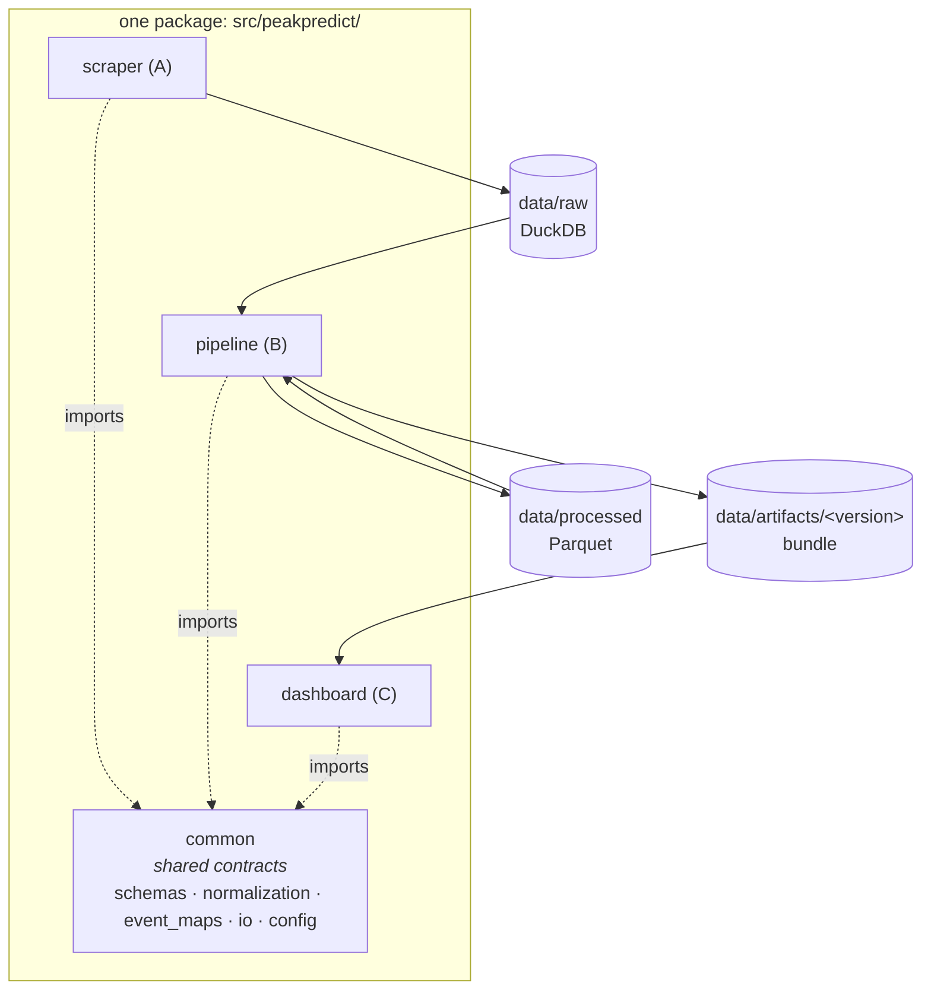

# Architecture

> [← back to README](../README.md) · Software-engineering deep dive

peakpredict is **three loosely-coupled components shipped as one installable package**.
The components never call each other in process — they communicate only through data
written to disk under explicit, versioned contracts. This is the central design decision,
and everything else follows from it.

## Why three components, one package

The three components have genuinely different operational profiles:

- the **scraper** is slow, network-bound, credentialed, and run rarely;
- the **pipeline** is CPU-bound batch compute, run on a schedule;
- the **dashboard** is a long-lived interactive service that must never scrape or train.

Decoupling them through on-disk data contracts means each can be developed, tested, run,
and scaled independently — the dashboard can be redeployed without touching the scraper;
the pipeline can be re-run on new data without the dashboard knowing.

But the *contracts* they share — the scoring function, the feature schema, the upload
schema — must have **exactly one implementation**. If the normalization that trains the
model lived in the pipeline and a second copy lived in the dashboard, a manually-entered
mark would be scored differently from how the model was trained, and predictions would
silently drift. So the components ship as one package with a shared `common` module, and
that module is the single source of truth.

> **The invariant that matters most:** the dashboard scores an uploaded mark with the
> bundle's own normalizer — byte-for-byte the function the model trained against.

## `common` — the contracts

Everything that crosses a component boundary is defined here and imported by everyone.

| Module | Responsibility |
|---|---|
| `schemas.py` | Pydantic v2 models for every cross-boundary object: `UploadedAthlete`, `PeakPrediction`, `FeatureSchema`, `ArtifactManifest`. No loose dicts cross boundaries. |
| `normalization.py` | The scoring function. `ZScoreNormalizer` does within-(event, sex), direction-aware standardization so a score is always higher-is-better. The single implementation, fit by the pipeline and re-loaded by the dashboard. |
| `event_maps.py` | Event id ↔ name (`40`=100 m, `50`=200 m, `70`=400 m), the supported v1 set, and per-event "is lower better". |
| `io.py` | DuckDB connection + raw-store DDL, and Parquet read/write. Centralizes how every component opens storage. |
| `config.py` | Secret loading via a single accessor that never logs or echoes values. |
| `logging.py` | Consistent structured logging. |

Pydantic-at-the-boundary is a deliberate choice: it turns "did the upload have the right
shape?" from a runtime surprise deep in the model into a validation error at the edge,
with a clear message.

## Component A — `scraper`

Acquires raw data into the DuckDB **raw store** (`data/raw/`). Built on Selenium because
the source authenticates through a JavaScript login. Designed around three realities of
scraping a live, credentialed site:

- **Session recycling** — one login per run; the authenticated session's cookies are saved
  and reused, with the browser recreated periodically to bound memory. Logging in
  repeatedly triggers rate-limiting, so the scraper goes out of its way to log in *once*.
- **Resumability** — a `scrape_state` table tracks per-athlete status (`pending`/`done`/
  `failed`), so a run that stops can resume exactly where it left off. A full sprint scrape
  is ~12 hours; it must survive interruption.
- **Failure recovery** — browser/connection death is detected and the session transparently
  recovered, distinguishing a dead session from a transient error.

The raw store schema (athlete, event, performance, scrape_state) is the A→B contract.

## Component B — `pipeline`

Reads the raw store and produces a **versioned artifact bundle**. Two layers:

1. **Data layer** — `season_best` (reduce raw results to per-season bests, with the
   age/wind/plausibility guards), `normalize` (fit + apply the scoring function),
   `trajectory` (fit the performance-vs-age curve), `labels` (extract peak ages),
   `features` (leakage-safe early-career features), `aggregates` (population percentile
   bands), `indicators` (which features correlate with peak age).
2. **Model layer** — `model` (the baseline + ridge rungs), `rnn` (the sequence rung),
   `evaluate` (temporal athlete-grouped cross-validation), `publish` (assemble the bundle).

`publish` trains the ladder, evaluates each rung on the temporal split, selects the
lowest-error model, and writes a self-contained bundle. See
[modeling](modeling.md) for the ladder and [data-pipeline](data-pipeline.md) for the data
layer.

## Component C — `dashboard`

A credential-gated Streamlit app that **consumes a bundle only** — it never scrapes or
trains. It loads the artifact bundle, refuses to serve one whose feature-schema version it
doesn't understand, and offers three pages: explore the roster, view an athlete's
trajectory, and upload your own athlete for a projected peak.

The non-UI logic (`service.py`) is deliberately separated from the Streamlit layer so it
is unit-testable without a browser — loading a bundle, scoring an upload, resolving
actual-vs-predicted peak, and assembling the roster are all pure functions.

## The artifact bundle — the B→C contract

The bundle is the entire interface between the pipeline and the dashboard. It is
self-contained and **versioned** (`data/artifacts/<UTC-timestamp>/`), so deployments are
reproducible and a dashboard can be pinned to a specific version:

| File | Contents |
|---|---|
| `predictor.pkl` | The selected model + its `primary` tag (`baseline` / `ridge` / `rnn`) |
| `normalization.json` | The fitted scoring function — so the dashboard scores marks identically |
| `feature_schema.json` | The versioned feature contract; the dashboard refuses incompatible schemas |
| `season_bests.parquet`, `labels.parquet`, `athletes.parquet` | The per-athlete data the explore page needs |
| `aggregates.parquet` | Population percentile bands for the chart overlay |
| `similar_index.parquet` | Nearest-neighbour index for "similar athletes" |
| `indicators.json` | Which early-career features correlate with peak age |
| `validation.json` | The held-out metrics for every rung (so the app can show its own honesty) |
| `manifest.json` | Version, code commit, data snapshot, schema version, headline metrics |

A `manifest` recording the **code commit** and **data snapshot** that produced each bundle
means any served prediction is traceable back to the exact code and data that made it.

## Testing strategy

- **Unit tests** for every pure function — normalization round-trips, trajectory vertex
  recovery, feature leakage guards, the model ladder, the upload scoring path.
- **An end-to-end test** (`tests/test_e2e.py`) that runs the entire chain on synthetic
  data: raw store → build → publish → predict, asserting the bundle is well-formed and a
  prediction comes out the other end.
- **A dashboard smoke test** using Streamlit's `AppTest` so the multipage app is exercised
  headlessly in CI.

91 tests in total; `ruff` (line length 100) and `pytest` are the gates that must pass
before any commit.

## Conventions

- Cross-boundary data is **pydantic models**, never loose dicts.
- Target ≤ ~400 lines per module — modules are small and single-purpose.
- `main` holds the pre-build baseline; `develop` is the working branch for the v1 build.
- The build was produced with a **documentation-first, spec-driven workflow**; the design
  documents live in `specs/`. Once written, the implementation stands on its own — the code
  is the contract, not the specs.

---

Next: **[Data pipeline →](data-pipeline.md)** · **[ML modeling →](modeling.md)**
