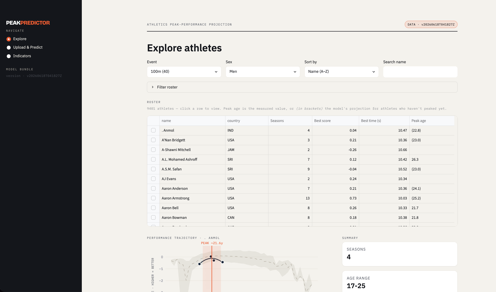
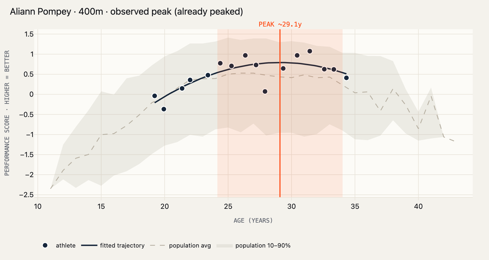
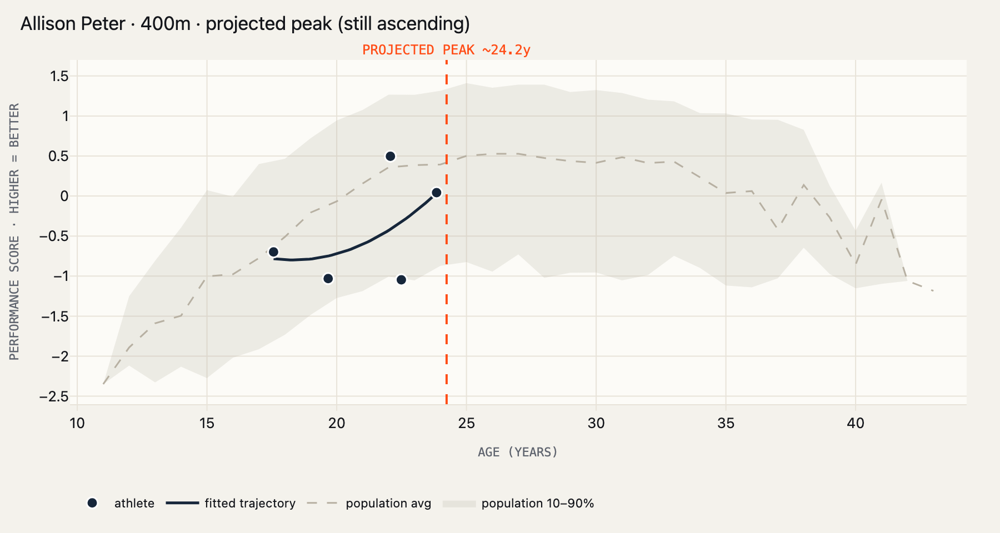
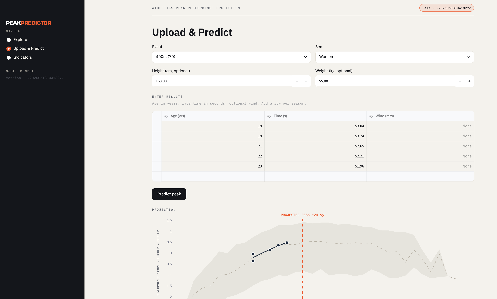
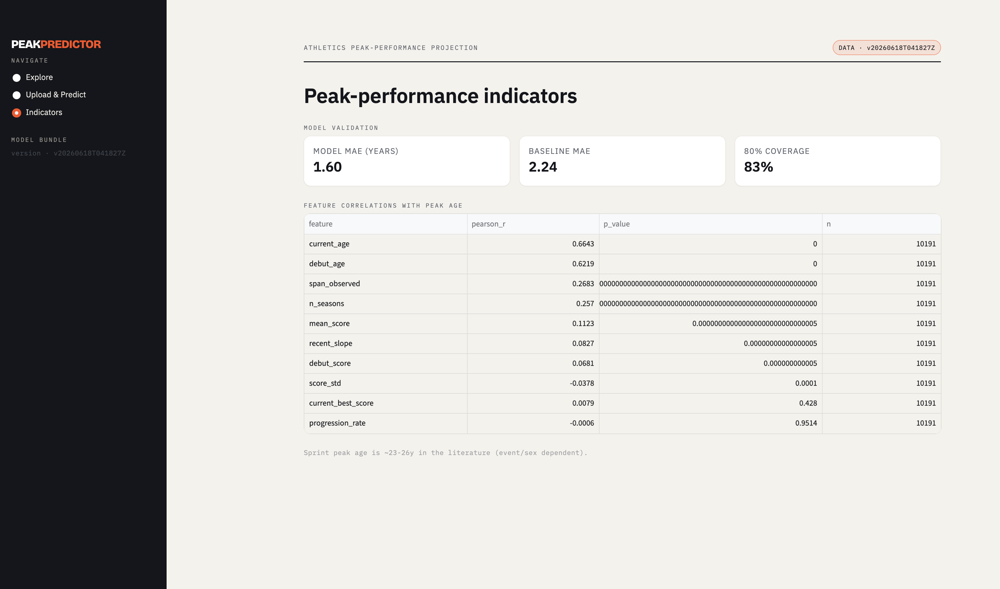

# Dashboard

> [← back to README](../README.md) · Product & UX walkthrough

The dashboard (Component C) is a credential-gated Streamlit app that **consumes an artifact
bundle only** — it never scrapes or trains. It turns the model into something a sports
scientist, coach, or talent scout can actually use: explore the roster, inspect an athlete's
trajectory, and upload a developing athlete to get a projected peak.

```bash
streamlit run src/peakpredict/dashboard/app.py     # set PEAKPREDICT_BUNDLE to pin a version
```

> **Screenshots.** The Plotly trajectory charts below are rendered directly from the
> dashboard's charting code on real bundle data. Full-page UI captures are listed in
> [`images/SCREENSHOTS.md`](images/SCREENSHOTS.md) — run the app and drop them in to complete
> this page.

## Three pages

| Page | Purpose |
|---|---|
| **Explore** | Browse the ~14 k-athlete roster, filter/sort, click an athlete to see their trajectory, peak, and similar athletes. |
| **Upload & Predict** | Enter a developing athlete's season-by-season times and get a projected peak with an interval. |
| **Indicators** | Which early-career features correlate with peak age, plus the model's own held-out validation metrics. |

## Explore

The roster is a sortable, filterable table — by country, seasons, best score, best time, and
peak age. Each athlete shows their **best time** (the actual fastest mark in seconds) and a
**peak age** that is either *measured* (shown plainly) or the model's *projection* (shown in
brackets) for athletes who haven't peaked yet.

<!-- Capture: Explore page with the roster table. Save as images/dashboard-explore.png -->


Clicking an athlete renders the **hero chart** — the centerpiece visual — overlaying their
observed season-bests, the fitted trajectory, the population percentile band, and the peak.

### Actual vs projected peak — the key UX decision

The system distinguishes two fundamentally different things and never conflates them:

- **An athlete who has already peaked** → the *observed* peak (solid line, "PEAK"). This is
  history, read off the trajectory's interior maximum.
- **An athlete still ascending** → the model's *projected* peak (dashed line, "PROJECTED
  PEAK"), with an interval. This is a prediction, and it's labelled as one.

| Already peaked → observed | Still ascending → projected |
|---|---|
|  |  |

The same distinction propagates to the roster's peak-age column, where projections appear in
brackets — so a user scanning the table can tell measured fact from model estimate at a
glance.

## Upload & Predict

A coach enters a developing athlete's results — age and **race time (seconds)** per season,
optional wind, optional height/weight — and gets a projected peak age, an 80% interval, and
the same hero chart plotting their trajectory against the population.

<!-- Capture: Upload & Predict page with a result entered and a projection shown. Save as images/dashboard-upload.png -->


Crucially, the uploaded marks are scored with the **bundle's own normalizer** — the exact
function the model was trained on — so an uploaded athlete is treated identically to a
training athlete. The app guards the edges: an unsupported event/sex, too few seasons, or
inputs outside the model's training range are each flagged with an honest message rather than
a confident-looking wrong answer.

## Indicators

The third page surfaces the analysis behind the predictions: which early-career features
correlate with peak age, and the model's own **held-out validation metrics** — the dashboard
shows its own accuracy rather than asking the user to take it on faith.

<!-- Capture: Indicators page. Save as images/dashboard-indicators.png -->


## Design & engineering notes

- **A precision-instrument aesthetic** — a warm-paper palette, a vermilion accent reserved
  for the peak, distinctive display/mono typography, and a single hero chart that reads the
  same on both the Explore and Upload pages. The visual language treats a prediction as a
  measurement off an instrument.
- **Testable without a browser.** All non-UI logic lives in `service.py` as pure functions
  (load a bundle, score an upload, resolve actual-vs-predicted, assemble the roster), unit-
  tested directly; a Streamlit `AppTest` smoke test exercises the multipage app headlessly.
- **Performance.** Roster-wide peak projections are computed in **one batched forward pass**
  and cached per (bundle, event, sex), so the table stays responsive across reruns.
- **Bundle-version aware.** The app refuses a bundle whose feature-schema version it doesn't
  understand, and can be pinned to a specific version via `PEAKPREDICT_BUNDLE` — so a
  deployment is reproducible and a model rollback is a one-line change.

---

Next: **[Architecture →](architecture.md)** · **[Results & limitations →](results.md)**
