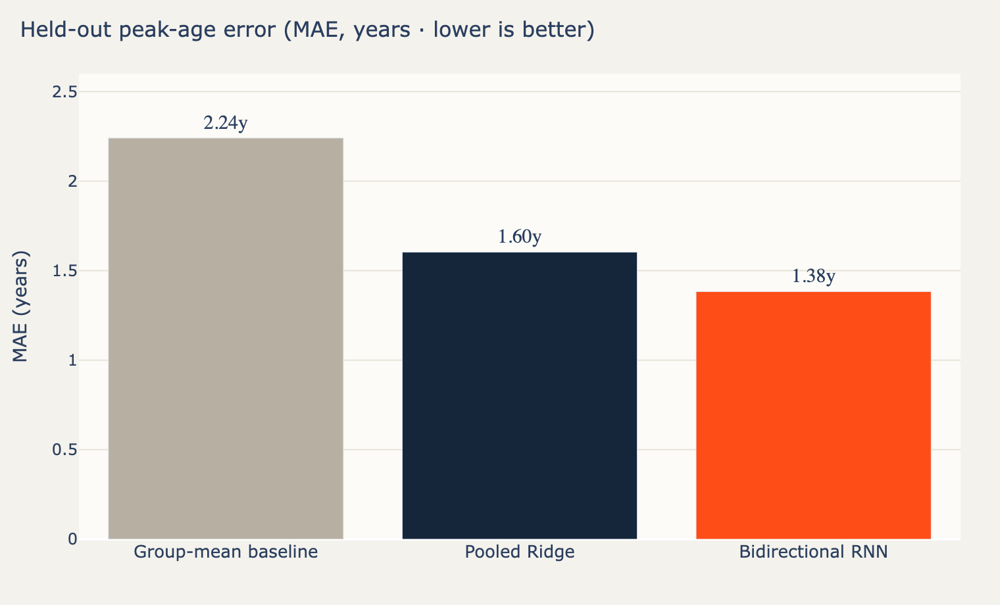

# ML modeling & experimentation

> [← back to README](../README.md) · Machine-learning deep dive

The modeling problem: **given an athlete's early-career season-bests, predict the age at
which they will peak in a given event.** This document covers how "peak" becomes a
learnable target, the baseline-first model ladder, the PyTorch sequence model that won, and
the experiment-tracking and hyperparameter-optimization workflow that got it there.

<p align="center">
  
</p>

## Peak as a label

A model needs a number to predict. Each athlete's career is fit as a quadratic in age
(`score = a·age² + b·age + c`); because the normalized score is higher-is-better, a career
is an inverted-U and the **peak age is the vertex**, `−b/2a` (when `a < 0`). That vertex,
extracted per (athlete, event, sex), is the regression target. See
[data-pipeline](data-pipeline.md#4-from-trajectory-to-a-peak-label) for how the label is
built; this document is about predicting it from early-career features.

## Evaluation first — temporal, athlete-grouped

Before any model, the **evaluation** is defined, because it determines what "better" means.
Peak prediction is a forward-in-time problem, so the validation mimics it:

- **Athlete-grouped split** — no athlete appears in both train and test (a leakage assertion
  enforces this every fold). Predicting a held-out athlete's peak from their early seasons
  is the real task.
- **5-fold group cross-validation** over ~7 k labelled athletes.
- **Metrics**: mean absolute error in years (the headline), RMSE, bias, and **prediction-
  interval coverage** — what fraction of true peaks fall inside the model's stated interval.

Coverage matters as much as MAE: a peak prediction the dashboard *shows with an interval*
is only honest if that interval is calibrated.

## The model ladder

A core principle: **baseline-first**. Every more-complex model must beat the simpler one
below it on the temporal split, or it isn't adopted. Three rungs:

| Rung | Model | Held-out MAE | Skill vs baseline | Coverage |
|---|---|---:|---:|---:|
| Floor | **Group-mean baseline** — predict the mean peak age for the athlete's (event, sex) | 2.24 y | — | 0.81 |
| v1 | **Pooled Ridge** — engineered features + physical, one-hot (event, sex), partial pooling via regularization | 1.60 y | 0.28 | 0.83 |
| Production | **Bidirectional RNN** — a sequence model over the season-by-season trajectory | **1.38 y** | **0.38** | 0.84 |

The baseline is not a throwaway — it is the floor that makes every other number meaningful.
"38% skill" means the production model closes 38% of the gap between guessing the group mean
and perfect prediction.

### Rung 2 — Pooled Ridge

A regularized linear regression over the leakage-safe engineered features, with a
`ColumnTransformer`: standard-scale the engineered features; median-impute (+ a missingness
indicator) and scale the often-absent physical features; one-hot the event and sex. The
regularization gives **partial pooling** — events and sexes share statistical strength
rather than being modeled in isolation. Its prediction interval is an **out-of-fold
residual std**, so the calibration it reports is the calibration it ships.

### Rung 3 — the RNN

The engineered features compress a career into summary statistics. A sequence model can
instead read the **raw shape** of the trajectory season by season. The architecture
(`pipeline/rnn.py`, PyTorch):

```
per-season (age, score) sequence ─► bidirectional LSTM ─┐
                                                        ├─► MLP head ─► peak age
static (event, sex, height, weight) ────────────────────┘
```

- a **bidirectional** recurrent core over the variable-length season sequence (packed so
  padding is ignored);
- the final hidden state concatenated with static athlete attributes;
- an MLP head regressing the (standardized) peak age;
- early stopping on a validation fold; a **grouped-CV out-of-fold residual std** for honest
  prediction intervals — the same calibration discipline as the ridge rung.

## Experimentation — Comet.ml, a sweep, and a Bayesian optimizer

Choosing the RNN's architecture and hyperparameters was done as tracked experiments, not by
hand-tuning in the dark. Everything streamed to **Comet.ml**.

1. **A curated sweep** (`analysis/rnn_sweep.py`) — 12 configurations × 2 seeds, varying
   hidden size, cell type (LSTM/GRU), depth, bidirectionality, dropout, learning rate, and
   weight decay, ranked by validation MAE.
2. **A Bayesian optimizer** (`analysis/rnn_optimizer.py`) — Comet's `Optimizer` searching
   the architecture space over 15 trials, each evaluated on the same held-out split.
3. **A confirmation run** (`analysis/rnn_confirm.py`) — the winning configuration vs the
   default over 5 seeds, to separate a real edge from seed noise.

> **Engineering detail that bites everyone once:** `comet_ml` must be imported *before*
> `torch` for its auto-instrumentation to attach. The experiment scripts do this
> deliberately, with a comment, so the warning never reappears.

## The decisive finding: data was the lever, not architecture

The most important result of the whole project is methodological. On a small early dataset
the RNN sat ~1.53 y and the gap to ridge looked like an architecture story. After the full
~7× scrape, three independent lines of evidence converged:

- The **sweep** showed every sensible architecture clustered in a 0.03 y band (1.39–1.42 y
  test MAE) — architecture barely mattered.
- The **Bayesian optimizer** could not beat that cluster; it was searching a nearly-flat
  surface.
- The **confirmation** showed the bidirectional edge over the default had collapsed to
  +0.003 y — a tie — its only remaining merit being *lower seed variance* (±0.008 vs ±0.016).

The conclusion, stated honestly: **more data — not a cleverer model — moved the error
floor.** The RNN improved from 1.53 → 1.38 y purely from scale, and the production choice
(a plain bidirectional RNN) was made for *stability*, not a meaningful accuracy edge. This
is the kind of result that's easy to fake with one lucky run and hard to earn with proper
seeds and held-out splits — so it's worth stating plainly.

A companion experiment removed the engineered `score` and fed the model raw marks, testing
whether the network could rediscover cross-event normalization itself. It could not beat the
score representation — confirming that the z-score normalization is doing real, useful work
that raw data doesn't hand the model for free.

## Productionizing the winner — into the ladder, not beside it

The RNN is not a notebook artifact bolted on; it is a **rung on the same ladder**, adopted
by the exact mechanism the ladder always used. At `publish` time:

1. all three rungs are trained and evaluated on the temporal split;
2. `publish` selects the lowest-MAE rung (ties break toward the simpler model);
3. the RNN wins, so the bundle ships `primary = rnn`.

Making this production-grade meant solving the real problems:

- **Serialization.** `RNNPredictor` stores only picklable state — config, weights as NumPy
  arrays, normalization statistics, and the calibrated residual std — and lazily rebuilds the
  `torch` module on demand. The bundle loads without importing torch; inference uses it.
- **A clean inference contract.** The tabular rungs expose `predict_one(features)`; the
  sequence model exposes `predict_series(series)`. The dashboard branches on the bundle's
  `primary` tag, so adding the RNN changed the consumer by one conditional.
- **Batched inference.** `predict_series_batch` scores an entire roster in one forward pass,
  so the dashboard can show projected peaks for thousands of athletes without a per-row loop.
- **Dependency honesty.** `torch` moved from an "experimental" extra to a real dependency of
  the pipeline and dashboard — because it is now production, not a side experiment.

The whole change shipped test-first: unit tests for fit/predict, the pickle round-trip
determinism, the missing-physical path, and the batched predictor.

## What an honest result looks like

The model is strong on athletes who peak near the population norm and **regresses to the
mean for genuine late-bloomers** — an athlete whose best season comes at 31 has nothing in
their first five seasons that signals it, and the model pulls them toward the average. That
limitation is quantified, not hidden, in **[Results & limitations →](results.md)**.

---

Next: **[Results & limitations →](results.md)** · **[Dashboard →](dashboard.md)**
